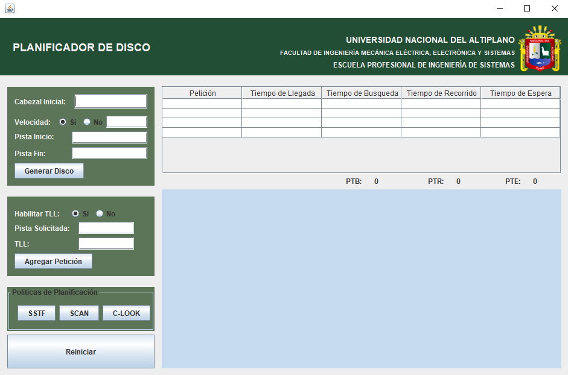
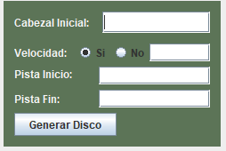
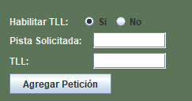
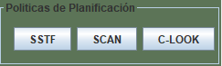
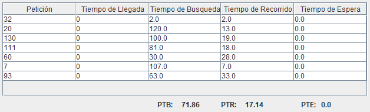
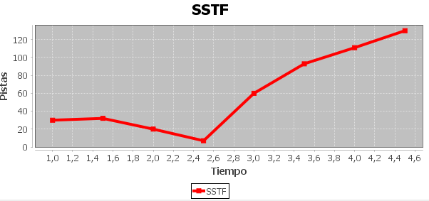

# Gestor de Disco
Autor: Erick Godoy

## Caracteristicas
-	Lenguaje de Programación: Java
-	Entorno de Desarrollo Integrado (IDE): NetBeans
-	Paquete de Creación de Graficas: JFreeChart

## Interfaz del Programa

## Especificar Datos del Disco
Registro de la posición inicial del cabezal, selección opcional para indicar la velocidad del cabezal. 

Indicar la pista de inicio y fin del disco.

## Peticiones
Registro de peticiones considerando si se desea agregar el tiempo de llegada de estas peticiones.

## Politicas de Gestion de Disco

-	SSTF. Las peticiones son atendidas de acuerdo a cuál se encuentre más cerca desde la posición actual del cabezal de escritura/lectura.
-	SCAN. En esta política las peticiones son atendidas según sean encontradas por el cabezal, que recorre de manera descendente o ascendente el disco. Cuando llega a un extremo del disco el cabezal cambia su recorrido en el sentido contrario para continuar.
-	C-LOOK. Es un algoritmo en el que el cabezal se dirige en un solo sentido para el recorrido de disco, cuando atiende la última petición que se encuentre en un lado del disco, retorna directamente desde el inicio de un extremo del disco.

## Resultados

La aplicación muestra un cuadro donde se puede apreciar los resultados obtenidos para cada petición registrada, indicando su tiempo de búsqueda, tiempo de recorrido y tiempo de espera. Por último, se indica el tiempo promedio obtenido en cada uno de estos.

Grafica que muestra el recorrido del cabezal desde su posición inicial hasta atender cada una de las peticiones solicitadas.

